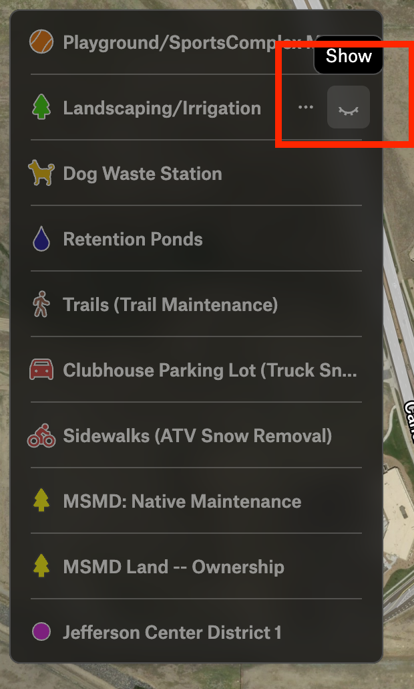

# Mountain Shadows Metro District Maps

The main District map is hosted in a free account on [Felt](https://www.felt.com).  Only [Greg
Rutz](mailto:greg80303@yahoo.com), Director, has write access at this time.  Anyone can read the
map and enable/disable layers to see different aspects of the District.

[DISTRICT MAP](https://felt.com/map/Moutain-Shadows-Metro-Discrict-Arvada-CO-Responsibilities-Map-1NyMDr8xRLej89AyxqqDHnC?loc=39.857712,-105.155628,16.61z) 

## MSMD General Maintenance Budget

This map highlights most of the areas where MSMD spends its general maintenance funds to clean,
beautify, and preserve the common areas in and around Whisper Creek.  These maintenance duties include:
* Landscaping, weeding, and watering of grass/tree/shrub areas
* Native grasses maintenance (beauty bands along sidewalks and fire-protection bands along community fences)
* Dog waste removal
* Trail maintenance (mostly weed mitigation)
* Playground/sports-complex maintenance
* Retention pond maintenance (as required by the City of Arvada)
* Snow removal (sidewalks and clubhouse parking lot)

## Navigation Tips

Basic maps navigation:
* MouseWheel to zoom in/out
* Left-click and drag to pan the map view
* Hold the `Z` key and then click/drag to select a specific area of the map to zoom 

## Legend / Layers 

The map highlights several different aspects of the District's involvement in the Whisper Creek
community in Arvada, CO. Each unique aspect is captured in a "layer", and you can enable/disable
layers using the legend in the upper left of the screen.

